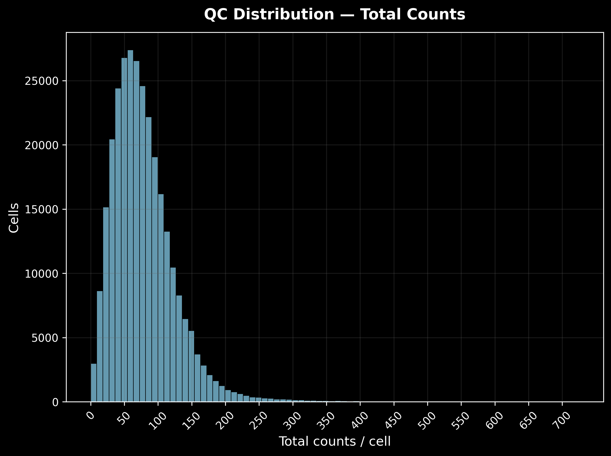
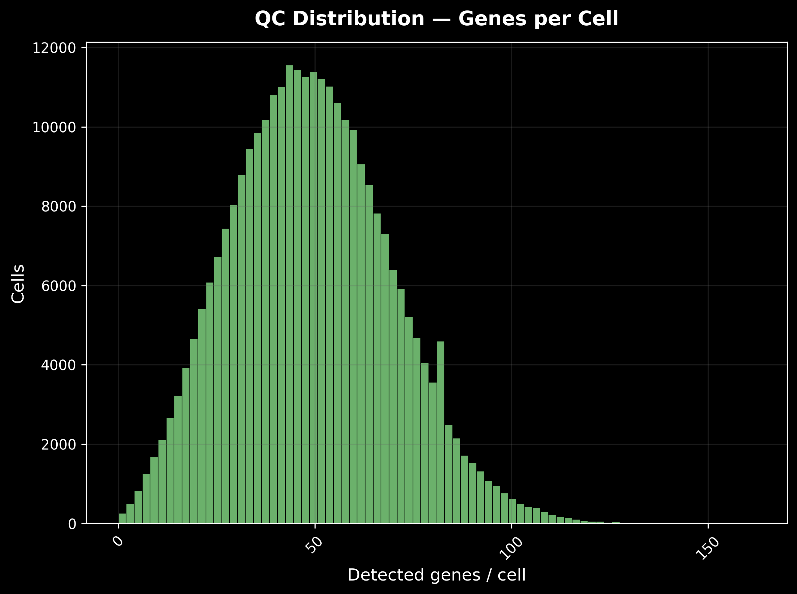
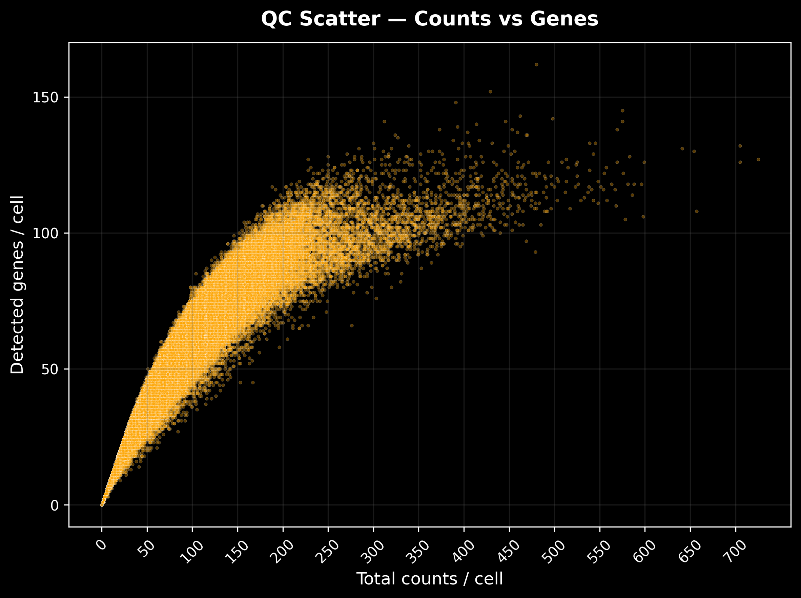
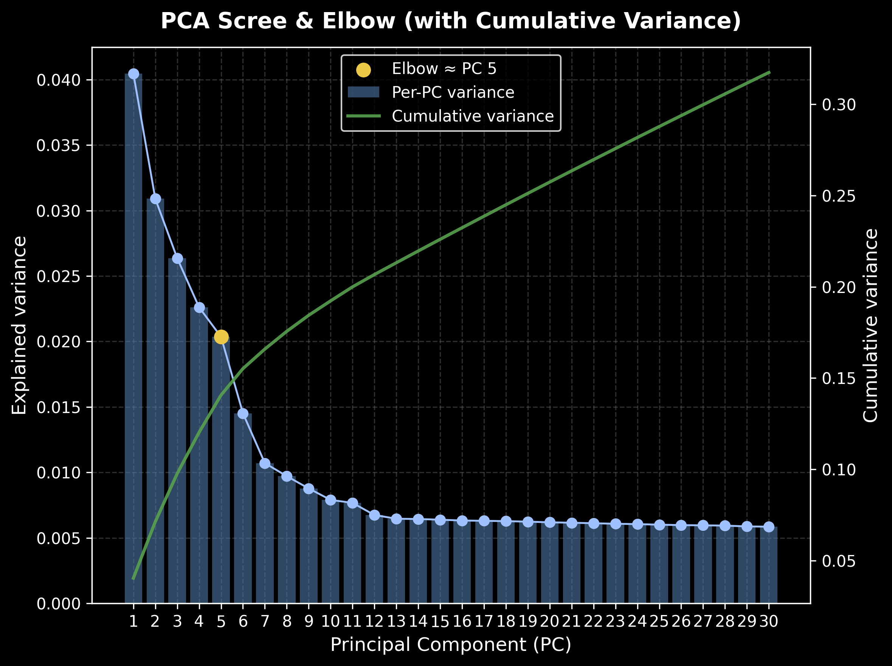

# xenium2anndata-analysis-workflow

**Dataset:** *Xenium Human Lung Preview — Non-diseased FFPE*  
**Source & Download:** [10x Genomics — Xenium Human Lung Preview (standard)](https://www.10xgenomics.com/datasets/xenium-human-lung-preview-data-1-standard)  
Licensed under [CC BY 4.0](https://creativecommons.org/licenses/by/4.0/)

---

## 📖 Glossary
- [Overview](#overview)
- [Why this detailed pipeline matters](#why-this-detailed-pipeline-matters)
- [Repository Contents](#repository-contents)
- [Getting Started](#getting-started)
- [Figures](#figures)
- [Attribution](#attribution)

---

## Overview  
This repository implements a transparent and flexible pipeline for processing **Xenium spatial transcriptomics** data from raw output to spatial visualization.  

Unlike workflows that depend on Zarr or aggregated formats, this approach uses **step-by-step raw data processing** for reproducibility and educational clarity.

---

## Why this detailed pipeline matters

1. **Reproducibility & clarity**  
   You manually stream and filter transcripts (e.g., Q ≥ 20) and build the cell×gene matrix, making every step clear and auditable.

2. **Robustness to changes**  
   Xenium data format may change over time; this pipeline handles schema differences gracefully (e.g. variations in column names like `x_location` vs `x_centroid`).  

3. **Scalability & memory efficiency**  
   The two-pass Arrow/Parquet batching avoids memory issues, allowing for large datasets to be handled smoothly.

4. **Customizable & extensible**  
   Users can easily adjust quality thresholds or extend the pipeline to other spatial platforms (e.g., CosMx, MERFISH).

---

## Repository Contents

- **scripts/unpack_all.py** — Extracts Xenium data from zipped output bundles.  
- **notebooks/preview_quickstart.ipynb** — Walk-through notebook to:
  - Load raw `cells.parquet` and `transcripts.parquet`, plus image and metrics files  
  - Filter and build a sparse count matrix  
  - Construct and QC an `AnnData` object  
  - Normalize, cluster, and visualize spatial patterns  
  - Compute neighborhood enrichment and save results

---

## Getting Started

1. Clone this repository  
   ```bash
   git clone https://github.com/jrs-orellana/xenium2anndata-analysis-workflow
   ```
2. Download the Xenium dataset ZIP from the link above and place it in `data/`.  
3. Run `python scripts/unpack_all.py` to extract the dataset.  
4. Install dependencies (see below).  
5. Open and run the notebooks to process the data:  
   - `01_xenium_raw2anndata.ipynb` — conversion from raw Parquet → AnnData  
   - `02_xenium_downstream.ipynb` — QC, clustering, marker detection, spatial plots  
6. Explore results in `results/figures/` and the processed `.h5ad` file.

---

## Dependencies

Main packages required (see full `requirements.txt` for exact versions):  

- [scanpy](https://scanpy.readthedocs.io/) — single-cell analysis and visualization  
- [squidpy](https://squidpy.readthedocs.io/) — spatial transcriptomics analysis  
- [spatialdata-io](https://github.com/scverse/spatialdata-io) — Xenium/Visium data import  
- [pyarrow](https://arrow.apache.org/) — efficient batch processing of Parquet files  
- [numpy](https://numpy.org/) and [pandas](https://pandas.pydata.org/) — data handling  
- [matplotlib](https://matplotlib.org/) and [seaborn](https://seaborn.pydata.org/) — visualization  

Install via:  
```bash
pip install -r requirements.txt
```
---

## Figures  

### Quality Control
| Total Counts | Genes per Cell | Counts vs Genes |
|--------------|----------------|-----------------|
|  |  |  |

### Spatial Density & Dimensionality Reduction
| Post-QC Density | PCA Scree | UMAP Leiden |
|-----------------|-----------|-------------|
|  |  |  |

### Gene Counts & Leiden Clusters
| n Genes by Cell | Total Counts | Leiden Clusters | Sub-clusters |
|-----------------|--------------|-----------------|--------------|
|  |  |  |  |

### Additional Selected Results
| Cluster 4–7 | Cluster 8 | Cell Type Scores | Marker Dotplot |
|-------------|-----------|------------------|----------------|
|  |  |  |  |

---

## Citation  

If you use this repository or adapt parts of the workflow, please cite it as:  

**APA style:**  
> Orellana-Montes, J. (2025). *xenium2anndata-analysis-workflow: Transparent pipeline for Xenium spatial transcriptomics*. GitHub. Available at: [https://github.com/jrs-orellana/xenium2anndata-analysis-workflow](https://github.com/jrs-orellana/xenium2anndata-analysis-workflow)  

**BibTeX:**  
```bibtex
@misc{xenium2anndata2025,
  author       = {Julio Orellana-Montes},
  title        = {xenium2anndata-analysis-workflow: Transparent pipeline for Xenium spatial transcriptomics},
  year         = {2025},
  publisher    = {GitHub},
  journal      = {GitHub repository},
  howpublished = {\url{https://github.com/jrs-orellana/xenium2anndata-analysis-workflow}}
}
```
---
## Attribution  
Dataset: *Xenium Human Lung Preview — Non-diseased FFPE*, 10x Genomics (licensed under [CC BY 4.0](https://creativecommons.org/licenses/by/4.0/)).  
Please cite per [10x Genomics citation guidelines](https://www.10xgenomics.com/resources/citations).

---

## Repo Summary  
- **Name:** `xenium2anndata-analysis-workflow`  
- **Purpose:** Detailed, manual parsing and processing of Xenium raw data  
- **Strengths:** Transparency, flexibility, reproducibility over convenience  

---

## Roadmap 🚀  
Planned extensions for this repository include:  
- Integration with additional spatial transcriptomics platforms (e.g., **CosMx**, **MERFISH**).  
- Adding batch correction and cross-sample integration modules.  
- Enhanced visualization (interactive dashboards with **napari** or **Bokeh**).  
- Tutorials for exporting processed data to standard formats (e.g., `.loom`, `.h5ad` sharing).  

---

## License  
This project is released under the **MIT License**. See [LICENSE](LICENSE) for details.  

Dataset belongs to **10x Genomics** and is licensed under **CC BY 4.0**.  

---

## Contact  
Maintainer: **Julio Orellana-Montes**  
For questions, suggestions, or collaborations: open an issue or pull request on GitHub,  
or contact me at **julio.orellana@upch.pe**  
